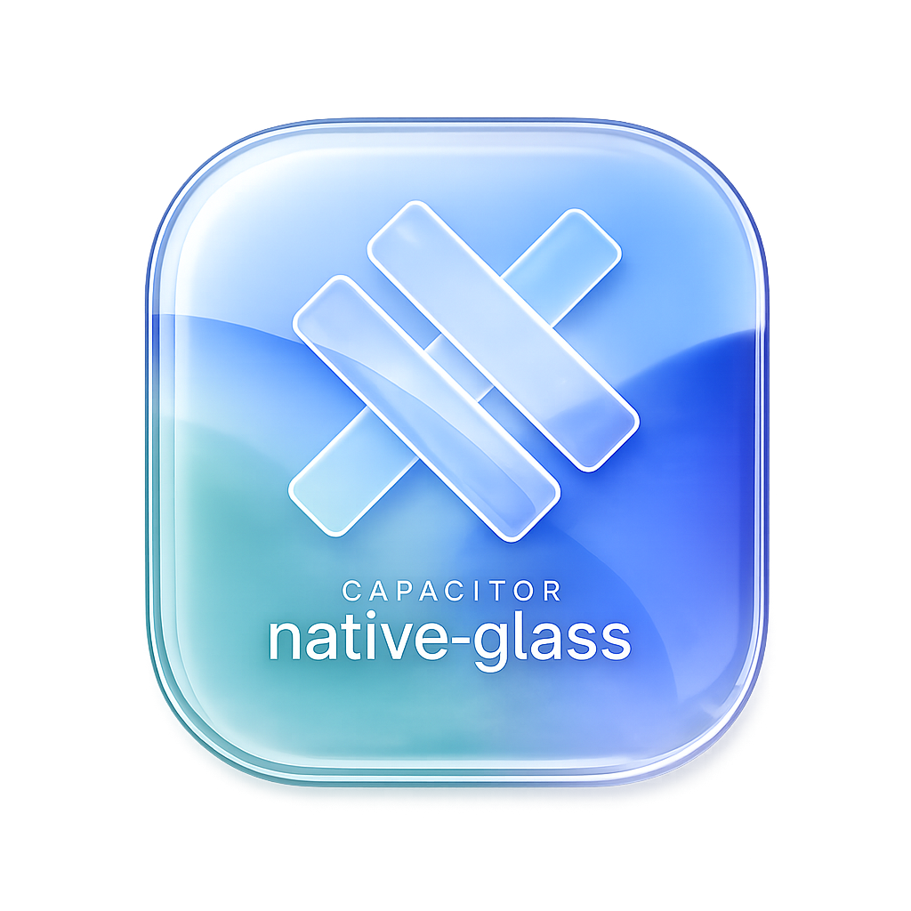

<p align="center">
  
</p>

<h1 align="center">Capacitor Native Glass</h1>

<p align="center">
  Real <strong>iOS 26 Liquid Glass</strong> surfaces for Capacitor apps —
  the native material, not a CSS imitation.
  <br />
  Native UIKit overlays over your WebView. SF Symbols. Auto-discovered.
</p>

<p align="center">
  <a href="https://www.npmjs.com/package/capacitor-native-glass"></a>
  <a href="https://www.npmjs.com/package/capacitor-native-glass"></a>
  <a href="./LICENSE"></a>
  
  
</p>

---

## Why?

The iOS 26 Liquid Glass effect is a **Metal/UIKit render** — dynamic refraction that
samples the content behind it. It **cannot be reproduced in CSS**. Web UI kits (`backdrop-filter:
blur`, etc.) only *imitate* the material: the components look plausible, but the "glass" gives
away that it's web.

The only real path in a Capacitor app is to render **genuine native views as overlays** on top
of the WebView and bridge their interactions back to JavaScript — the same technique native maps
and camera previews use. This plugin does exactly that, for the surfaces a content app actually
needs (bars, FAB, panel, mini-player, morphing).

## Features

- **Real Liquid Glass** — genuine `UIGlassEffect` / auto-glass UIKit views, not CSS
- **7 surfaces** — nav bar, toolbar, FAB, tinted interactive panel, native controls, morphing, mini-player
- **Morphing** — glass bubbles that converge and merge (`UIGlassContainerEffect`)
- **SF Symbols** — usable natively (impossible in the web layer)
- **Touch passthrough** — a `hitTest` host view lets taps reach the WebView outside the controls
- **Event bridge** — native taps surface in JS via `addListener('action', …)`
- **Auto-discovered** — SPM `Package.swift` + CocoaPods podspec, **zero Xcode setup**
- **Graceful fallback** — `UIBlurEffect` material below iOS 26
- **Capacitor 8**, TypeScript types included

## Demo

> Captured on a real iPhone (iOS 26). Real Liquid Glass only renders on device.

### Morphing

https://github.com/user-attachments/assets/d0359dde-7016-40f2-8efe-1b7e46726747

### Mini-player

https://github.com/user-attachments/assets/5234bfc2-c6fd-4fa7-a746-4868f5d41730

### Tab bar

https://github.com/user-attachments/assets/0fd3c064-be86-4015-94e2-5b21c1c1790e

### Native controls

https://github.com/user-attachments/assets/7ecd0b18-9fdb-4cec-97ac-e9eeefaa805b

### Tinted panel

https://github.com/user-attachments/assets/997271da-2b05-4a80-9ca4-3f7f731cfe62

### Floating button

https://github.com/user-attachments/assets/011a458d-8d1d-4c07-8731-8fcdf9cd02c2

### Toolbar

https://github.com/user-attachments/assets/cb0651b8-ab80-44ac-acd2-b015d455c5dd

## Installation

```bash
npm install capacitor-native-glass
npx cap sync ios
```

No Xcode configuration needed — the plugin registers itself.

> **Requirements:** Capacitor ≥ 8, and **iOS 26 + Xcode 26** for real Liquid Glass.
> Older iOS falls back to a material blur.

## Quick Start

```ts
import { NativeGlass } from 'capacitor-native-glass'

// show native chrome
await NativeGlass.showNavbar({ title: 'MaBible' })
await NativeGlass.showToolbar({ items: ['Share', 'Favorite', 'Settings'] })
await NativeGlass.showMiniPlayer({ title: 'Now playing' })

// react to native taps
const sub = await NativeGlass.addListener('action', ({ id }) => {
  console.log('native action:', id) // "toolbar:Share", "segment:1", "miniplayer:playpause"…
})

// tear down
await NativeGlass.hideAll()
sub.remove()
```

## API

| Method | Renders |
|---|---|
| `showNavbar({ title })` | top `UINavigationBar` (auto-glass) |
| `showToolbar({ items })` | bottom `UIToolbar` (auto-glass) |
| `showFab({ systemIcon })` | floating `UIButton(.glass())` — `systemIcon` is an SF Symbol |
| `showPanel({ text })` | interactive, tinted `UIGlassEffect` panel |
| `showControls()` | native `UISegmentedControl` + `UISlider` + `UISearchBar` |
| `showMorphing()` | `UIGlassContainerEffect` — bubbles that merge & split |
| `showMiniPlayer({ title })` | floating glass "now playing" bar |
| `hide({ surface })` | removes a single surface (`'toolbar' \| 'navbar' \| 'fab' \| 'panel' \| 'controls' \| 'morphing' \| 'miniPlayer'`) |
| `hideAll()` | removes every surface |
| `addListener('action', cb)` | native interaction events (`{ id }`) |

## Notes & limitations

- **Edge-anchored only.** Surfaces are fixed to screen edges; they don't scroll-sync with in-page
  DOM content (that jitters against WKWebView's async scrolling). Use them as chrome.
- **Touch passthrough** is handled by a transparent host view whose `hitTest` returns `nil`
  outside the actual controls, so the WebView keeps receiving taps.
- **iOS only.** On web/Android the methods reject with *"not implemented"*.

## License

MIT © imri-engineer
